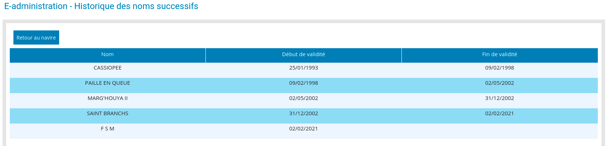

# FSM

## Perché questo nome
Il nome è volutamente polisemico. Qua alcuni dei significati possibili, trovate o inventate il vostro.

### Alcuni significati

*che mi hanno convinto a scegliere questo acronimo:*

[Free Software Movement](https://www.gnu.org/philosophy/free-software-intro.en.html)
[Federated States of Micronesia](http://www.visit-micronesia.fm/)
[Flying Spaghetti Monster](https://www.spaghettimonster.org/)
[Free Speech Movement](http://www.fsm-a.org/)
Per una lista: https://en.wikipedia.org/wiki/FSM

### Le proposte degli amici

*In ordine alfabetico.*

Fabbisogno Serale di [Martini|Mojito}]
Fabbrica di Salame di Maiale
Facciamo Senza Microsoft
Faccio Solo Miglia
Faccio Solo Minchiate
Fachiro Super Morbido
Facoltoso Studente Mediocre
Faire Sans Moteur/Fare Senza Motore
Fai Sempre a Modino
Fai Sogni Meravigliosi
Fai Solo Mare
Falce Senza Martello
Falso Sacerdote Mormone
Falso Sacramento del Matrimonio
Falso Salame di Maiale
Fameux Skipper Méditérranéen/Famoso Skipper Mediterraneo
Fanculo, Sogno Mare
Fantasie Sado-Maso
Fantastica Sirena Magica
Faremo Sempre Meglio
Farfalla Sul Mare
Farfalla Sul Mondo
Farfalle Sul Mekong
Farlocco Skipper Mediterraneo
Farting Sound Machine
Fatti Sfatti Misfatti
Fatto Senza Morti
Faunalia Semper Movere
Faunalia Società Marittima
Faut Savoir Mediter
Fava Solo Molle
Favorita Signora del Mare
Featuring Sex with Minors
Fédération des Skippers de la Mediterranee
Felice Sul Mare
Felicità Sei Mia
Felicità Sul Mare
Fémmena Su a Minghia
Femmina Sotto ( o Sopra) Maschio
Fermare Subito Microsoft
Feroce Scannatore di Mostri
Feroce Strappo al Malleolo
Ferreus Sed Magnanimus
Ferrovie Statali Metallizzate
Ffff Ssss Malaka!!!
Fica Superiore alla Media
Fichi Senza Misura
Figa Sei Matto
Figa So Mare [veneto per: accidempolina, sua madre]
Figata Senza Misura
Figlio Santissimo di Maria
File System Mounted
Filibusterie San Maman
Filo Sul Mare
Finalmente Solo Me
Finalmente Sono Marinante
Fine Settimane Migliore
Finestra Sul Mondo
Fingo di Stare Male
Fingo di Suonare le Maracas
Finite State Machine
Fiocco Sul Mare
Fiore Sardo e Miele
Firmus Sed Magnanimus
Fischia Sempre Melodie
FiSherMan
Fisico-Spirito-Mente
FiSseMammete
Flâneur Sur Mer
Flimsy Moral Standards
Fluorescent Sea Moonlight
Flying Sex Machine
Foca Snella e Magra
Focus Sulla Meta
Foglia Sul Mare
Folie Sans Mesure/Follia Senza Misura
Folle Senza Miglia
Fonte Straordinaria di Miracoli
Food Service Méditerranée
Foraggio Senza Mucche
Force Sept Marins
Force Simple Masculine
For Sailing Miracles
Forse è Solo un Malore
Forse Sarebbe Meglio
Forse Saremo Migliori
Forse Si Muove
Forse Sono Matto
Forse Sono Meglio
Forse Sono Morto
Forse Sputo in Mare
Forte Saggio Meritevole
Forte Salivazione Mucosa
Forte Saveur de Mer
Forte Spirito Maligno
Forte Stimolatore Magnetico
Forte Stimolo alla Minzione
Fortuna ho Sbagliato Mira
Fortuna Sei Mia
Fortuna Silver Mines
Fortuna Solo Meritata
Forza Saremo Migliori
Fotti Sempre Meglio
Fottuti Sommergibili Militari
Fratello Sono Miope
Freaking Stupid Manager
Freedom Sailing Master
Free Sailing Motion
Free Ship Movement
Free Ship of Mine
Free Software Manager
Free Software Master
Free Space Map
Free Spirit in Motion
Freud Senza Mutande
Friggo [Sardine|Spigole|Seppie] Marinate
Frontières Sans Militaires
Frugo Sotto Monnezza
Fruit Salad Mix
Frutto Succoso e Morbido|Fruit Sucré et Mûr
Fucking Sailing Mentor
Fucking Snow Memories
Fugue Sur Mer
Fully Sustainable Model
Fulmine Saette e Monsoni
Funziona Senza Manometterlo
Fuori Stazza Massima
Furto Straordinario di Mandolini
Futile Sacrificio Misterioso
Futuro Senza Mostri
Φιλά Σαν Μελτέμι
Φυσά Σαν Μελτέμι

### I nomi precedenti

